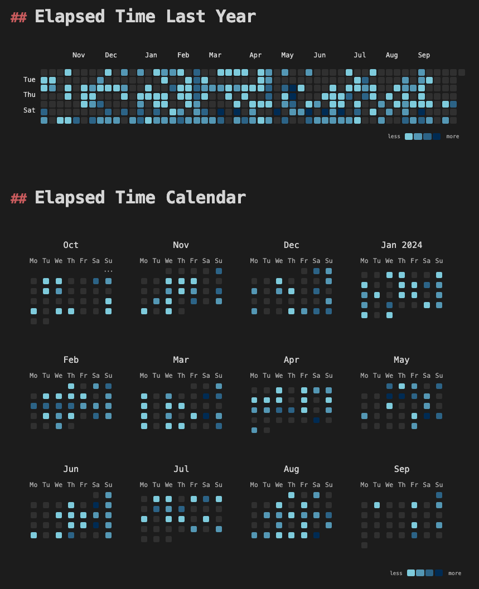

  


# Obsidian Strava Sync

This plugin syncronizes activities from [Strava](https://www.strava.com/) into [Obsidian](https://obsidian.md).

- 🗄️ Import [Strava bulk export](https://support.strava.com/hc/en-us/articles/216918437-Exporting-your-Data-and-Bulk-Export#h_01GG58HC4F1BGQ9PQZZVANN6WF) CSV files for historical activities
- 📅 Sync recent activities from Strava via the [Strava API](https://developers.strava.com/docs/reference/#api-Activities-getLoggedInAthleteActivities)
- 📝 [Handlebars.js](https://handlebarsjs.com/guide/) templates for imported activities
- 💿 Customizable properties / front matter allowing for [Obsidian Dataview](https://blacksmithgu.github.io/obsidian-dataview/) integration
- 🏃 Per-sport icons for use with [Iconize](https://florianwoelki.github.io/obsidian-iconize/)

The purpose of this plugin is not to provide a data backup, or to replace the functionality of the Strava apps. It's simply to allow activities to be more easily referenced, tracked and visualized within Obsidian, especially through integration with existing plugins like [Obsidian Dataview](https://blacksmithgu.github.io/obsidian-dataview/).

## Examples

<p align="center">
  
  
  
</p>

These are some examples of what can be achieved along with the [Dataview](https://blacksmithgu.github.io/obsidian-dataview/), [Charts](https://charts.phib.ro/Meta/Charts/Charts+Documentation) and [Contribution Graph](https://github.com/vran-dev/obsidian-contribution-graph) plugins. See the [Dataview Integration](#dataview-integration) section below for more ideas.

## Installation

This plugin is currently in beta testing phase. The recommended installation method is via the [BRAT plugin](https://tfthacker.com/brat-quick-guide#Adding+a+beta+plugin):

1. Install BRAT from the Community Plugins in Obsidian
2. Open the command palette and run the command "BRAT: Add a beta plugin for testing"
3. Paste `https://github.com/watsonbox/obsidian-strava-sync` into the modal that opens up
4. Click on Add Plugin 🎉

### Manually installing the plugin

It's also possible to install the plugin manually:

1. Download the latest release from [the releases page](https://github.com/watsonbox/obsidian-strava-sync/releases).
2. Copy `main.js`, `styles.css`, and `manifest.json` to your vault's `VaultFolder/.obsidian/plugins/obsidian-strava-sync/` directory.

### Sync Configuration

In order to configure the plugin, you will need to obtain an access token from Strava. You can do this by going to "My API Applications" [here](https://www.strava.com/settings/api) and creating a new application as follows:


Once that's done, copy the Client ID and Client Secret into the plugin settings, and click "Connect with Strava". You will be redirected to Strava to login and authorize access. After successful authorization, you will be redirected back to your Obsidian vault and can close the browser window.

## Basic Usage

Typically, once the plugin is enabled and configured, you'll want to set up templates for the activities as you import them. This can be done for the file path, the content itself, and the properties to be added.

### Templating

Templates can be set up in the plugin settings.

The default file path template is `Strava/{{start_date}}/{{id}} {{name}}`, which will create a folder for each day, and a file for each activity within that folder for example `Strava/2024-02-20/1234567890 Running with the bears.md`.

The date formats themselves can also be adjusted in the plugin settings.

#### Content

The default content template is:

```markdown
# {{name}}

[https://www.strava.com/activities/{{id}}](https://www.strava.com/activities/{{id}})
{{#if description}}

Description: {{description}}
{{/if}}
{{#if private_note}}

> [!NOTE] Private note
> {{private_note}}
{{/if}}

#Strava
```

This will produce a file similar to the following:

```markdown
# Running with the bears

[https://www.strava.com/activities/1234567890](https://www.strava.com/activities/1234567890)

Description: This is a description

> [!NOTE] Private note
> This is a private note
```

The templating language used is [Handlebars.js](https://handlebarsjs.com/guide/). The available fields are as follows (more info [here](https://developers.strava.com/docs/reference/#api-models-DetailedActivity)):

| Field                 | Example(s)                        | Description                                |
|-----------------------|-----------------------------------|--------------------------------------------|
| `id`                  | 1218940553                        | Unique identifier for the activity         |
| `start_date`          | "2024-08-28 05:07:43"             | Start date and time of the activity        |
| `name`                | "Dynamo Challenge 2024"           | Name of the activity                       |
| `sport_type`          | "Ride", "Run", "Swim", etc.       | Type of sport                              |
| `description`         | "Great weather and company"       | Description of the activity                |
| `private_note`        | "Take two inner tubes next time"  | Private note for the activity              |
| `elapsed_time`        | 38846                             | Total elapsed time in seconds              |
| `moving_time`         | 26010                             | Moving time in seconds                     |
| `distance`            | 154081.0                          | Distance in meters                         |
| `max_heart_rate`      | 180                               | Maximum heart rate                         |
| `max_speed`           | 18.8                              | Maximum speed in meters per second         |
| `average_speed`       | 11.1                              | Average speed in meters per second         |
| `total_elevation_gain`| 1338.0                            | Total elevation gain in meters             |
| `elev_low`            | 50.7                              | Lowest elevation in meters                 |
| `elev_high`           | 60.2                              | Highest elevation in meters                |
| `calories`            | 1234                              | Calories burned                            |
| `icon`                | 🚴‍♂️🏃🏊⛷️🏸🛶🏋️🚶🚵⛳🦽🥾<br>⛸️🛼🏄🏓🧘🧗🚣⛵🛹🏂⚽🎾 | Activity icon         |

#### Properties

Finally, you can also specify any of these fields to be added to the [properties](https://help.obsidian.md/Editing+and+formatting/Properties) / front matter of each imported activity. By default the properties are `name`, `start_date`, `sport_type`, `description`, `private_note`, `elapsed_time`, `moving_time`, `distance`, and `icon`, for example:

```
---
id: 1014355555
name: Evening Run
start_date: 2024-06-02T18:31:27.000Z
sport_type: Run
distance: 4372.5
elapsed_time: 1651
moving_time: 1511
description: "Great run"
private_note: "Push it to 10km next time"
icon: 🏃
---
```

The property `id` is always added.

### Importing Recent Activities

Next, either by clicking the Strava icon in the [ribbon](https://help.obsidian.md/User+interface/Ribbon) or using the command "Import new activities from Strava", the plugin will fetch and import your 30 most recent activities from Strava using the API.

Each time new activities are imported, the start date of the last imported activity is saved. Next time you import new activities, only activities after that date will be imported.

### Importing a Strava Bulk Export

Strava allows you to download your activities as a bulk export as described [here](https://support.strava.com/hc/en-us/articles/216918437-Exporting-your-Data-and-Bulk-Export#h_01GG58HC4F1BGQ9PQZZVANN6WF). This export contains all historical activities. Either in the plugin settings, or by using the "Import Strava activities from bulk export CSV" command directly, you can select the `activities.csv` file from the bulk export to import the entire history.

> [!NOTE]
> Note that the [Strava bulk export CSV format](./assets/activities.csv) is not the same as the [Web API activity format (JSON)](./assets/activity_12271989718.json). This plugin allows both formats to be imported, but some fields that are not common to both formats are not imported.

> [!TIP]
> You may prefer to exclude imported activities from the Obsidian search and graph views by adding the sync folder to "Options -> Files and linkes -> Excluded files" in the settings.

## Dataview Integration

Once you've selected the activity attributes you'd like to include as properties, the real power of this plugin comes from the Dataview integration. You can install it through the Community Plugins tab in Obsidian, and then refer to the detailed [documentation](https://blacksmithgu.github.io/obsidian-dataview/) to learn how to use it.

The following are some examples of what you can do with Dataview and the Strava plugin.

### List all activities with "knee" in private note

    ```dataview
    TABLE WITHOUT id name, dateformat(start_date, "yyyy-MM-dd") AS date, private_note
    FROM "Apps/Strava"
    WHERE icontains(private_note, "knee")
    ```

### List all activities for the current month in a callout

    > [!EXAMPLE] This Month's Activities
    >
    > ```dataview
    > TABLE WITHOUT id
    >   link(file.path, name) AS Activity,
    >   dateformat(localtime(start_date), "yyyy-MM-dd") AS Date,
    >   dur(round(elapsed_time/60) + "m") as Duration,
    >   choice(length(private_note) > 0, "📝", "") AS "📝",
    >   choice(icontains(private_note, "pain"), "🤕", "") AS "🤕"
    > FROM "Strava"
    > WHERE dateformat(start_date, "yyyy-MM") = dateformat(date(now),"yyyy-MM")
    > ```

### Show a chart of total distance per year by activity type

Using DataviewJS gives us much more flexibility, for example the ability to use the [Charts](https://charts.phib.ro/Meta/Charts/Charts+Documentation) plugin to visualize historical activity data.

    ```dataviewjs
```js
const pages = dv.pages('#Strava')
const dates = pages.map(p => p.start_date).values
const yearData = {};

pages.forEach(page => {
  const year = moment(page.start_date.ts).startOf('week').format('YYYY');
  const ridingDistance = page.sport_type === 'Ride' ? page.distance : 0;
  const runningDistance = page.sport_type === 'Run' ? page.distance : 0;

  if (!yearData.hasOwnProperty(year)) {
    yearData[year] = {
      ridingDistance: 0,
      runningDistance: 0
    };
  }

  yearData[year].ridingDistance += ridingDistance;
  yearData[year].runningDistance += runningDistance;
});

const years = Object.keys(yearData);
const ridingDistance = Object.values(yearData).map(data => data.ridingDistance);
const runningDistance = Object.values(yearData).map(data => data.runningDistance);

const chartData = {
  type: 'bar',
  data: {
    labels: years,
    datasets: [
      {
        label: '🚴 Riding distance',
        data: ridingDistance,
        backgroundColor: [ 'rgba(255, 99, 132, 0.2)' ],
        borderColor: [ 'rgba(255, 99, 132, 1)' ],
        borderWidth: 1
      },
      {
        label: '🏃 Running distance',
        data: runningDistance,
        backgroundColor: [ 'rgba(54, 162, 235, 0.2)' ],
    borderColor: [ 'rgba(54, 162, 235, 1)' ],
        borderWidth: 1
      }
    ]
  }
}
window.renderChart(chartData, this.container)
```
    ```

### Display a contribution heat map with Contribution Graph

Not technically a Dataview integration. This example requires that the [Contribution Graph plugin](https://github.com/vran-dev/obsidian-contribution-graph) first be installed and enabled.

    ```contributionGraph
    graphType: default
    dateRangeValue: 365
    dateRangeType: LATEST_DAYS
    startOfWeek: "1"
    showCellRuleIndicators: true
    titleStyle:
      textAlign: left
      fontSize: 15px
      fontWeight: normal
    dataSource:
      type: PAGE
      value: "#Strava"
      dateField:
        type: PAGE_PROPERTY
        value: start_date
      countField:
        type: PAGE_PROPERTY
        value: elapsed_time
    fillTheScreen: false
    enableMainContainerShadow: false
    cellStyleRules:
      - id: Ocean_a
        color: "#8dd1e2"
        min: 1
        max: 3600
      - id: Ocean_b
        color: "#63a1be"
        min: 3600
        max: 7800
      - id: Ocean_c
        color: "#376d93"
        min: 7800
        max: 21600
      - id: Ocean_d
        color: "#012f60"
        min: 21600
        max: 100000
    cellStyle:
      minWidth: 10px
      minHeight: 10px
    ```

## Development Guidelines

- Clone this repo to a local development folder. For convenience, you can place this folder in your `.obsidian/plugins/obsidian-strava-sync` folder.
- Install NodeJS, then run `yarn install` in the command line under the repo folder.
- Run `yarn dev` to compile the plugin to `main.js`. Changes should be automatically compiled into `main.js`.
- Reload Obsidian to load the new version of the plugin.
- Enable the plugin in the settings window.

### Live Reloading

In order to avoid reloading Obsidian every time you make a change, you can use the [Hot-Reload plugin](https://github.com/pjeby/hot-reload) as [they suggest](https://docs.obsidian.md/Plugins/Getting+started/Build+a+plugin#Step+5+Update+the+source+code).

### Releasing

Run `yarn version` after updating `minAppVersion` manually in `manifest.json`. The command will bump version in `manifest.json` and `package.json`, and add the entry for the new version to `versions.json`

Run `yarn version`, enter a new version number, then push to build and prepare a draft release on GitHub.

> [!NOTE]
> You may need to run `yarn config set version-tag-prefix ""` before running `yarn version` to ensure the version tag is created correctly.

## Improve code quality with eslint (optional)
- [ESLint](https://eslint.org/) is a tool that analyzes your code to quickly find problems. You can run ESLint against your plugin to find common bugs and ways to improve your code.
- To use eslint with this project, make sure to install eslint from terminal:
  - `npm install -g eslint`
- To use eslint to analyze this project use this command:
  - `eslint main.ts`
  - eslint will then create a report with suggestions for code improvement by file and line number.
- If your source code is in a folder, such as `src`, you can use eslint with this command to analyze all files in that folder:
  - `eslint .\src\`

## Resources

- [Strava Developers - Authentication](https://developers.strava.com/docs/authentication/)
- [Strava Developers - API Reference](https://developers.strava.com/docs/reference/)
- [Strava Developers - Getting Started + Auth](https://developers.strava.com/docs/getting-started/)
- [Strava Developers - Rate limiting](https://developers.strava.com/docs/rate-limits/)
- [Challenges when Testing Plugins | Obsidian Collection](https://www.moritzjung.dev/obsidian-collection/plugin-dev/testing/challengeswhentestingplugins/)
- [Obsidian Dataview](https://blacksmithgu.github.io/obsidian-dataview/)


