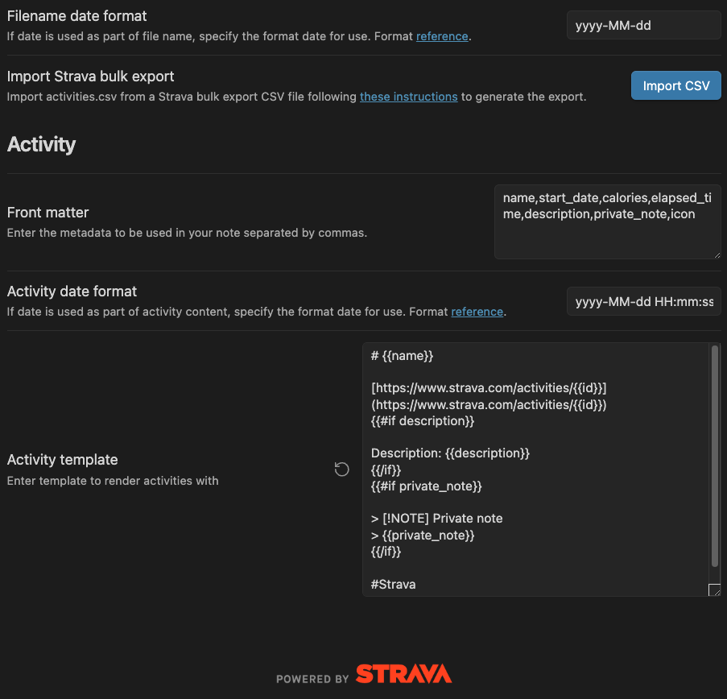
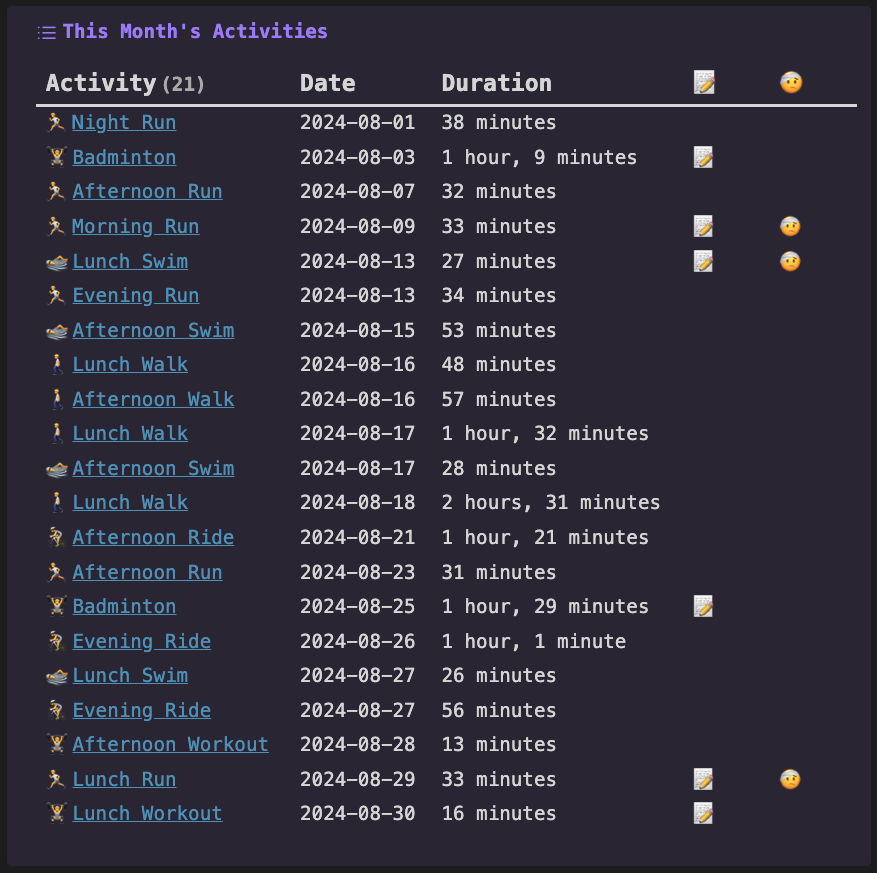
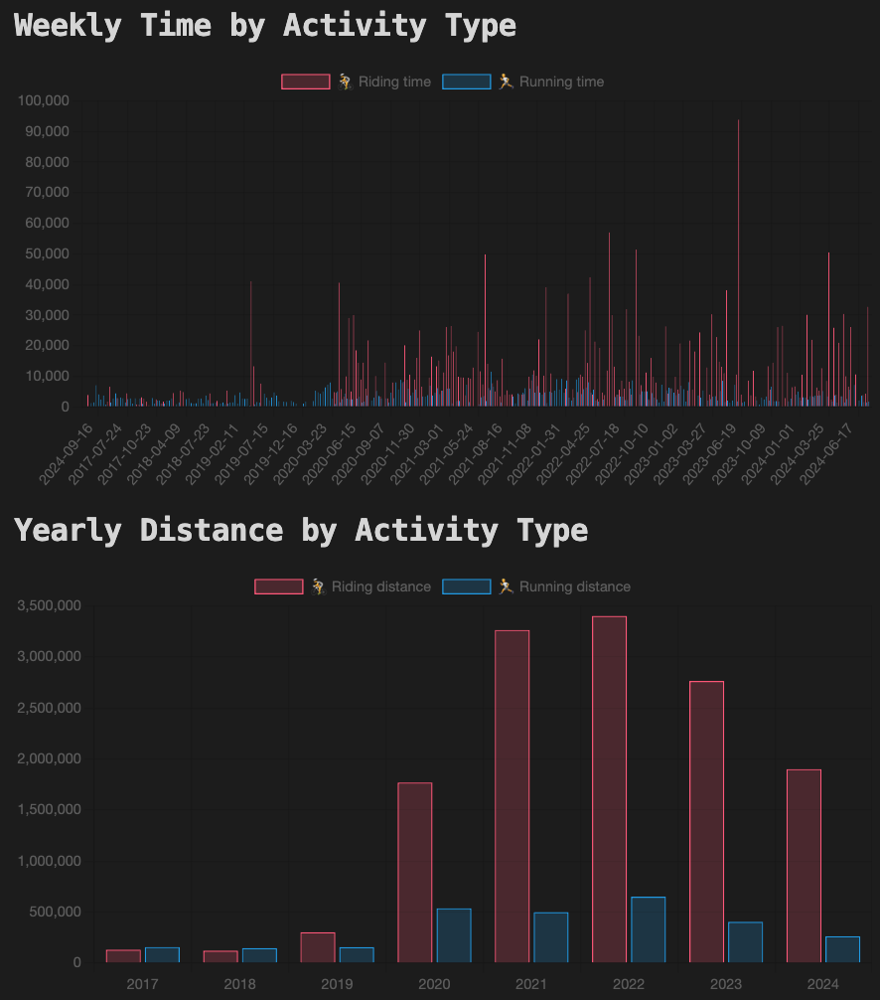
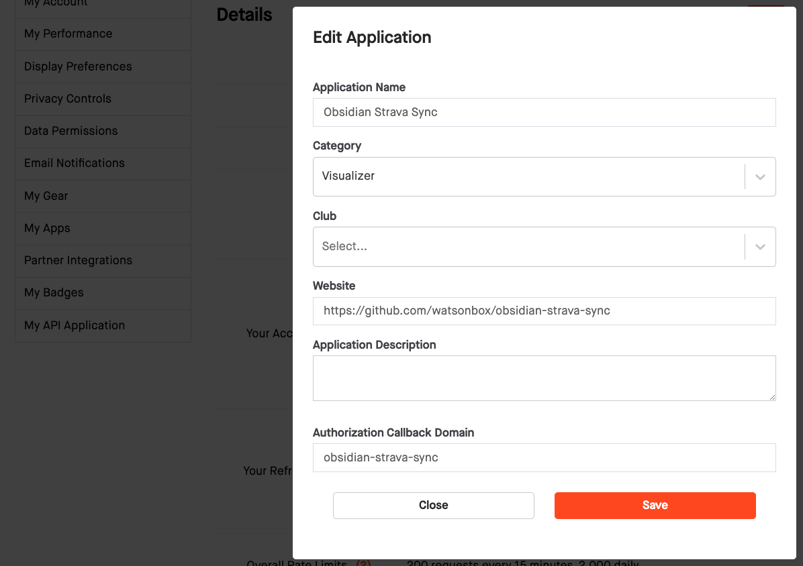

  

# Obsidian Strava Sync

This plugin syncs activities from [Strava](https://www.strava.com/) into [Obsidian](https://obsidian.md).

- 🗄️ Import [Strava bulk export](https://support.strava.com/hc/en-us/articles/216918437-Exporting-your-Data-and-Bulk-Export#h_01GG58HC4F1BGQ9PQZZVANN6WF) CSV files for historical activities
- 📅 Sync recent activities from Strava via the [Strava API](https://developers.strava.com/docs/reference/#api-Activities-getLoggedInAthleteActivities)
- 📝 [Handlebars.js](https://handlebarsjs.com/guide/) templates for imported activities
- 💿 Customizable front matter allowing for [Obsidian Dataview](https://blacksmithgu.github.io/obsidian-dataview/) integration

## Examples

  
  
  

These are some examples of what can be achieved along with the [Dataview](https://blacksmithgu.github.io/obsidian-dataview/) and [Charts](https://charts.phib.ro/Meta/Charts/Charts+Documentation) plugins.

## Installation

This plugin is currently only available for manual installation.

### Manually installing the plugin

Copy over `main.js`, `styles.css`, `manifest.json` from [the latest release](https://github.com/watsonbox/obsidian-strava-sync/releases) to your vault `VaultFolder/.obsidian/plugins/obsidian-strava-sync/`.

### Sync Configuration

In order to configure the plugin, you will need to obtain an access token from Strava. You can do this by going to "My API Applications" [here](https://www.strava.com/settings/api) and creating a new application as follows:

Once that's done, copy the Client ID and Client Secret into the plugin settings, and click "Connect with Strava". You will be redirected to Strava to login and authorize access. After successful authorization, you will be redirected back to your Obsidian vault and can close the browser window.

## Development Guidelines

- Clone this repo to a local development folder. For convenience, you can place this folder in your `.obsidian/plugins/obsidian-strava-sync` folder.
- Install NodeJS, then run `yarn install` in the command line under the repo folder.
- Run `yarn dev` to compile the plugin to `main.js`. Changes should be automatically compiled into `main.js`.
- Reload Obsidian to load the new version of the plugin.
- Enable the plugin in the settings window.

### Live Reloading

In order to avoid reloading Obsidian every time you make a change, you can use the [Hot-Reload plugin](https://github.com/pjeby/hot-reload) as [they suggest](https://docs.obsidian.md/Plugins/Getting+started/Build+a+plugin#Step+5+Update+the+source+code).

### Releasing

Run `yarn version` after updating `minAppVersion` manually in `manifest.json`. The command will bump version in `manifest.json` and `package.json`, and add the entry for the new version to `versions.json`

Run `yarn version`, enter a new version number, then push to build and prepare a draft release on GitHub.

> [!NOTE]
> You may need to run `yarn config set version-tag-prefix ""` before running `yarn version` to ensure the version tag is created correctly.

## Improve code quality with eslint (optional)
- [ESLint](https://eslint.org/) is a tool that analyzes your code to quickly find problems. You can run ESLint against your plugin to find common bugs and ways to improve your code.
- To use eslint with this project, make sure to install eslint from terminal:
  - `npm install -g eslint`
- To use eslint to analyze this project use this command:
  - `eslint main.ts`
  - eslint will then create a report with suggestions for code improvement by file and line number.
- If your source code is in a folder, such as `src`, you can use eslint with this command to analyze all files in that folder:
  - `eslint .\src\`

## Resources

- [Strava Developers - Authentication](https://developers.strava.com/docs/authentication/)
- [Strava Developers - API Reference](https://developers.strava.com/docs/reference/)
- [Strava Developers - Getting Started + Auth](https://developers.strava.com/docs/getting-started/)
- [Strava Developers - Rate limiting](https://developers.strava.com/docs/rate-limits/)
- [Strava Account Data Request](https://www.strava.com/athlete/delete_your_account)
- [node-strava/node-strava-v3: API wrapper for Strava's v3 API](https://github.com/node-strava/node-strava-v3)
- [Challenges when Testing Plugins | Obsidian Collection](https://www.moritzjung.dev/obsidian-collection/plugin-dev/testing/challengeswhentestingplugins/)
- [Obsidian Dataview](https://blacksmithgu.github.io/obsidian-dataview/)

